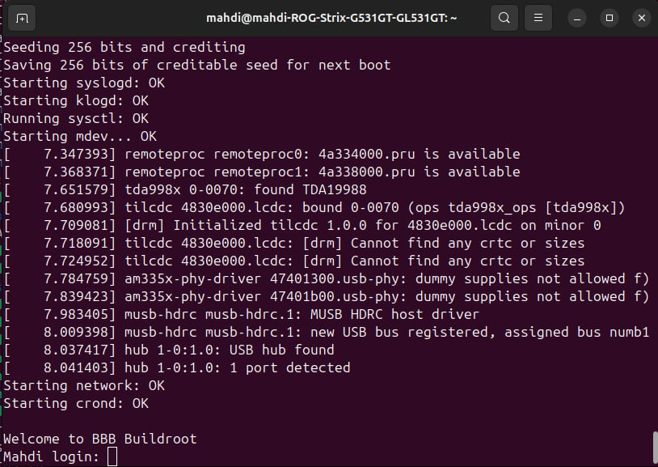

**BeagleBone Black – UART FTDI LED Control (Buildroot)**

This repository demonstrates a simple UART communication example between
a BeagleBone Black (BBB) and an external FTDI USB-UART adapter, allowing
you to control the usr0 LED using serial commands (ON / OFF).

The embedded Linux system is generated using **Buildroot** and flashed
onto an SD card.

A Linux image was generated with **Buildroot** and can be flashed to an
SD card using the following command:

Replace /dev/sdX with the correct device corresponding to your SD card.

Login : root

Password : root

**TestProject – LED Control via FTDI**

TestProject is a **minimal example** that allows you to turn the usr0
LED on or off by sending commands over UART from a PC or another device
using an FTDI adapter.

**UART Wiring (BBB ↔ FTDI)**

Example using **UART1 on the BeagleBone Black**

| **BeagleBone Black** | **FTDI** |
|----------------------|----------|
| P9.24 (TX)           | RX       |
| P9.26 (RX)           | TX       |
| P9.1 or P9.2         | GND      |

From the PC side (via FTDI serial terminal), send:

ON → Turn ON the usr0 LED

OFF → Turn OFF the usr0 LED

